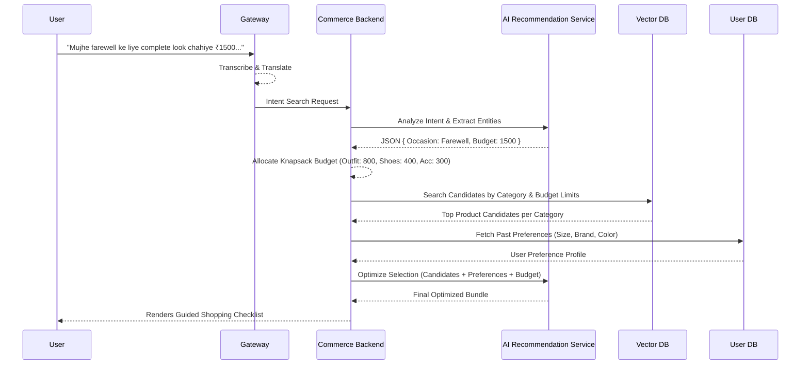
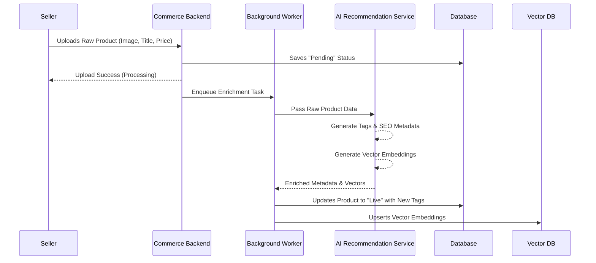

# Intent-Driven Commerce Using Agentic AI

Traditional e-commerce relies on strict keyword matching, assuming users know exact product names and categories. This project introduces an Agentic AI Shopping Assistant that **replaces keyword search with intent resolution**. It understands natural language queries, optimizes budgets across multiple categories, and guides users through a highly personalized purchase journey.

For millions of users across India — especially regional-language and less tech-savvy shoppers — discovering the right product remains a challenge. This system is built for them.

### Example

A user says: *"Mujhe farewell ke liye complete look chahiye ₹1500 ke andar."*

The AI resolves occasion, budget, and category requirements — then returns a fully optimized shopping checklist covering outfit, footwear, accessories, and handbag. No manual search. No category navigation. Just intent in, recommendations out.

#### Buyer Flow: Intent to Optimized Checklist



---

## Key Features

- **Natural Language Intent:** Conversational queries replace rigid keyword search.
- **Dynamic Budget Allocation:** A single budget is mathematically distributed across a multi-item checklist (e.g., Outfit: ₹800, Shoes: ₹400, Accessories: ₹300) using a Knapsack optimization algorithm.
- **Personalized Recommendations:** Past behavior, spending patterns, and brand preferences continuously sharpen future results.
- **Minimalist, Intent-First UI:** Guided checklists over endless scrolling — designed to reduce cognitive load.
- **Automated Catalog Enrichment:** AI generates structured tags, categories, and vector embeddings from raw product uploads, making seller onboarding effortless.

---

## Technology Stack

- **Frontend:** React.js
- **Backend:** Node.js with Express
- **Database & Vector Store:** MongoDB Atlas (Native Vector Search)
- **AI Orchestration:** Gemini API (wrapped in an abstract service layer)
- **Translation/Voice:** Bhashini API / Whisper (regional language processing)

---

## Design Choices & Reasoning

- **Minimalist, Intent-First UI:** The primary interaction point is a conversational interface (text/voice). A material-inspired, clean aesthetic reduces cognitive load for regional users, replacing category menus with a guided checklist flow.

- **Abstracted AI Middleware:** The core backend never interfaces directly with raw LLM prompts. AI logic lives in a dedicated service class, keeping business logic deterministic and provider-agnostic. Swapping LLM providers requires zero changes to the commerce engine.

- **Unified Database Strategy:** MongoDB Atlas handles both relational order data and vector embeddings in a single instance — no separate vector database, no additional deployment surface, lower latency.

---

## Backend Architecture: Extended MVC

Standard MVC is insufficient for AI-driven applications. AI orchestration and budget optimization are neither traditional database models nor simple API controllers. The backend extends MVC with two additional layers:

- **Controllers:** HTTP request handling, input validation, and response formatting.
- **Models:** Mongoose schemas for Users, Products, and Orders.
- **Services:** Standard business logic — authentication, payment processing.
- **AI Abstraction Layer:** Dedicated directory for `RecommendationService`, owning intent extraction, prompt engineering, and all LLM communication.
- **Algorithmic Utilities:** Pure functions for non-AI computation — primarily the Knapsack Budget Optimizer.

### Folder Structure

```plaintext
/project-root
│
├── /client                 # React Frontend
│   ├── /src
│   │   ├── /components     # Reusable UI (Checklists, Chat Bubbles)
│   │   ├── /hooks          # State management for conversational context
│   │   ├── /pages          # Main views (Home, Checkout)
│   │   └── /services       # API client calls to Node backend
│
└── /server                 # Node.js Backend
    ├── /src
    │   ├── /controllers    # Route handlers (e.g., IntentController)
    │   ├── /models         # Mongoose schemas (Product, User)
    │   ├── /routes         # Express router definitions
    │   ├── /services       # Standard business logic
    │   ├── /ai             # Extended MVC: AI Service Abstractions
    │   └── /utils          # Math/Budget optimizers
    ├── .env
    └── server.js           # Entry point
```

---

### Seller Flow: Automated Catalog Enrichment



---

## Implementation Phases

### Phase 1: Environment Setup & Core Modeling
- Initialize the monorepo with `/client` and `/server`.
- Configure environment variables (MongoDB URI, Gemini API keys, Port).
- Define core Mongoose models: User, Product (with vector embedding field), and Order.

### Phase 2: Catalog Enrichment (Seller Flow)
- Build the product upload route for sellers.
- Implement the AI Recommendation Service to generate structured tags (Occasion, Style) from raw product text or images.
- Use the LLM to produce vector embeddings and save enriched metadata to MongoDB.

### Phase 3: Intent Processing & Budgeting
- Set up the `/api/intent` route in the Express controller.
- Implement intent extraction to parse user queries into `{ "occasion": string, "budget": number }`.
- Build the Knapsack utility to distribute budget across logical categories.

### Phase 4: Vector Search Integration (Buyer Flow)
- Configure a Vector Search Index on the MongoDB Atlas cluster.
- Wire the backend to run similarity searches scoped by category and budget constraints.
- Pass candidates through the AI abstraction layer for final preference-aware optimization.

### Phase 5: Frontend Integration
- Build the React interface centered on a voice/text input block.
- Connect the frontend to the intent API endpoint.
- Render the optimized bundle as a dynamic shopping checklist.
